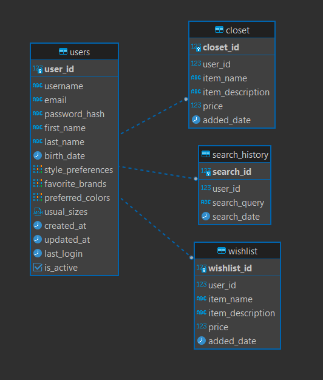

# cMatch
> Un sistema de búsqueda y recomendación de moda que aprovecha la similitud visual y textual, integrándose con las APIs de Inditex para proporcionar un descubrimiento y gestión de prendas de ropa.

## ¿Qué es y qué hace?
cMatch permite a los usuarios realizar búsquedas de prendas de ropa mediante la similitud visual de imágenes o texto, mediante la API de Inditex. Además, ofrece funcionalidades como una wishlist y un armario digital para almacenar prendas encontradas y deseadas, un chatbot de recomendación para sugerencias personalizadas, y una extensión de navegador para facilitar la búsqueda de imágenes mientras navegan.

## Cómo lo hicimos
La aplicación fue desarrollada utilizando Python, FastAPI para el backend, y Tailwind CSS junto con Alpine.js para el frontend. Para el desarrollo colaborativo, despliegue y pruebas, utilizamos contenedores de Docker y GitHub para el control de versiones.

- [x] Integración de búsqueda visual y textual
- [x] Extensión de navegador
- [x] Wishlist y armario de usuario
- [x] Agente de recomendaciones de moda
- [ ] Integración con redes sociales
- [ ] Soporte para múltiples APIs
- [ ] Análisis de estilo avanzado

## Quick Start

1. El único requisito necesario es tener Docker instalado en el sistema.
2. Una vez instalado, ejecuta uno de los siguientes comandos (dependerá de tu sistema operativo):

```bash
docker-compose down && docker-compose up --build
```

Tras ejecutarlo, los servicios estarán disponibles en las siguientes direcciones:
- Frontend: http://localhost
- API: http://localhost:8000
- Servicio del Agente: http://localhost:8001
- Base de datos: localhost:5432

Además, se usarán las siguientes variables de entorno:

### Base de datos

- POSTGRES_USER: `user`
- POSTGRES_PASSWORD: `password`
- POSTGRES_DB: `fashion_db`

### API

- DATABASE_URL: `postgresql://user:password@db:5432/fashion_db`
- SECRET_KEY: `your-secret-key-here`
- INTERNAL_TOKEN: `your_internal_token_here`

> [!CAUTION]
> Alerta sobre seguridad
> 
> Para un posible despliegue en producción;
>
> 1. Cambia las contraseñas por defecto
> 2. Gestiona adecuadamente tus secrets
> 3. Configura ajustes de CORS
> 4. Habilita SSL/TLS
> 5. Configura mecanismos de autenticación adecuados

## Estructura del Proyecto

cMatch/
├── agent
├── app
├── cMatch-extension
├── config.py
├── db
├── docker-compose.yml
├── Dockerfile
├── LICENSE
├── models
├── README.md
├── requirements.txt
├── src
└── static

## Diagrama de la Base de Datos



## Cómo contribuir
Este es un proyecto Open Source / de código abierto! Por ello, las contribuciones siempre son bienvenidas. Para contribuir, sigue los siguientes pasos:

1. Haz un fork del proyecto.
2. Desarrolla, añade los cambios al stage, y haz un commit.
3. Crea una pull request en el proyecto, y espera a ver su aceptación.

## Licencia
Este proyecto está licenciado bajo la MIT License. Consulta el archivo `LICENSE` para más detalles.